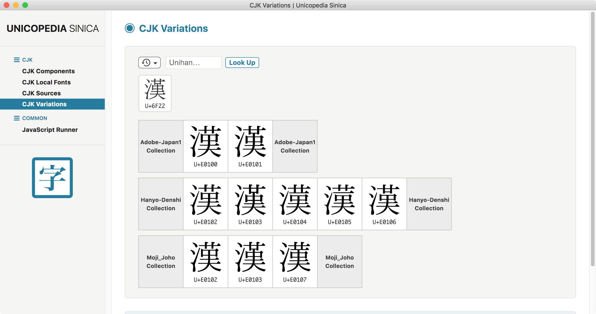
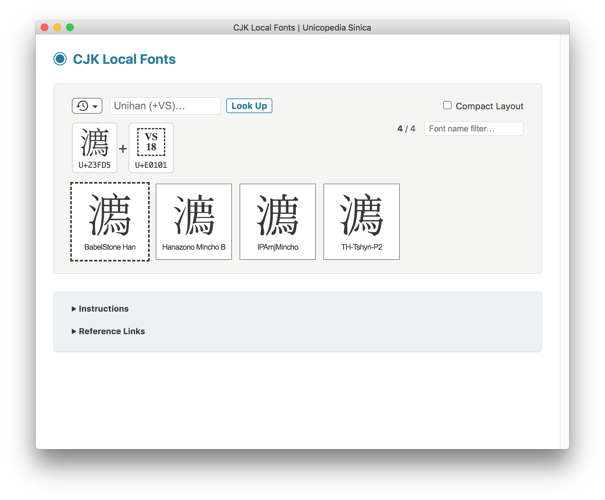
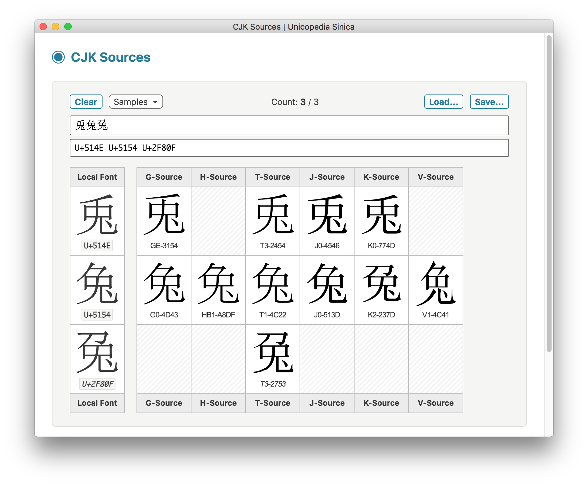

#  UNICOPEDIA SINICA

**Unicopedia Sinica** is a developer-oriented set of Unicode utilities related to ideographs, wrapped into one single app, built with [Electron](https://www.electronjs.org/).

This desktop application works on macOS, Linux and Windows operating systems.



## Utilities

The following utilities are currently available:

- **CJK Components**
    - **Look Up IDS**
    - **Parse IDS**
    - **Match IDS**
    - **Find by Components**
- **CJK Local Fonts**
- **CJK Sources**
- **JavaScript Runner**

## CJK Components

### Look Up IDS

- The **Look Up IDS** feature of the **CJK Components** utility displays all the IDS (Ideographic Description Sequences) of a given Unihan character, as compiled in the freely available [IDS.TXT](https://babelstone.co.uk/CJK/IDS.TXT) data file, maintained by [Andrew West](https://en.wikipedia.org/wiki/Andrew_West_(linguist)).
- Any Unihan character can be entered in the <kbd>Unihan</kbd> input field either as a character or a code point. Click on the <kbd>Look Up</kbd> button to display the IDS.
- Previously looked up characters are kept in a history stack; use the <kbd>Alt</kbd>+<kbd>↑</kbd> and <kbd>Alt</kbd>+<kbd>↓</kbd> keyboard shortcuts to navigate through them up and down inside the input field. Alternatively, you can also use the <kbd>Lookup&nbsp;History&nbsp;▾</kbd> pop-up menu to automatically look up a specific character.
- Click on the <kbd>Show Graphs</kbd> checkbox to display the IDS as graphs instead of text strings.
- IDS are provided for the set of 92,865 Unihan characters (excluding CJK *compatibility* ideographs) defined in **Unicode 14.0**.
- Notes:
    - Unencoded components of IDS, if any, are assigned code points belonging to the PUA (Private Use Area) block, and are properly displayed by using an embedded copy of the custom font [BabelStone Han PUA](https://www.babelstone.co.uk/Fonts/PUA.html), created by [Andrew West](https://en.wikipedia.org/wiki/Andrew_West_(linguist)).
    - For best display results, most recent versions of the following fonts should be downloaded and installed at the OS level:
        - [BabelStone Han](https://www.babelstone.co.uk/Fonts/Han.html) (`BabelStoneHan.ttf`)
        - [TH-Tshyn](http://cheonhyeong.com/Simplified/download.html) (`TH-Tshyn-P0.ttf`, `TH-Tshyn-P1.ttf`, `TH-Tshyn-P2.ttf`, `TH-Tshyn-P16.ttf`)
        <!-- - [Hanazono Mincho](https://github.com/cjkvi/HanaMinAFDKO/releases) (`HanaMinA.otf`, `HanaMinB.otf`, `HanaMinC.otf`) -->
    - The IDS are based on the reference character glyphs shown in their respective **Unicode 14.0** code charts:
        - [CJK Unified Ideographs - U4E00.pdf](https://www.unicode.org/charts/PDF/U4E00.pdf)
        - [CJK Unified Ideographs Extension A - U3400.pdf](https://www.unicode.org/charts/PDF/U3400.pdf)
        - [CJK Unified Ideographs Extension B - U20000.pdf](https://www.unicode.org/charts/PDF/U20000.pdf)
        - [CJK Unified Ideographs Extension C - U2A700.pdf](https://www.unicode.org/charts/PDF/U2A700.pdf)
        - [CJK Unified Ideographs Extension D - U2B740.pdf](https://www.unicode.org/charts/PDF/U2B740.pdf)
        - [CJK Unified Ideographs Extension E - U2B820.pdf](https://www.unicode.org/charts/PDF/U2B820.pdf)
        - [CJK Unified Ideographs Extension F - U2CEB0.pdf](https://www.unicode.org/charts/PDF/U2CEB0.pdf)
        - [CJK Unified Ideographs Extension G - U30000.pdf](https://www.unicode.org/charts/PDF/U30000.pdf)


### Parse IDS

- The **Parse IDS** feature of the **CJK Components** utility displays the parsing graph of any well-formed IDS (Ideographic Description Sequence).
- The IDS string can by directly typed, or pasted from the clipboard into the <kbd>IDS</kbd> input field.
- Optionally, a Unihan character can be used as reference in the <kbd>Entry</kbd> input field.
- It is possible to input predefined sets of Entry and IDS strings selected from the <kbd>Samples&nbsp;▾</kbd> pop-up menu.
- As a convenience, the input fields can be emptied using the <kbd>Clear</kbd> button.
- The IDS graph can be displayed either vertically or horizontally. Use the <kbd>Display Mode</kbd> drop-down menu to toggle between the two modes.
- Notes:
    - Unencoded components of IDS, if any, are assigned code points belonging to the PUA (Private Use Area) block, and are properly displayed by using an embedded copy of the custom font [BabelStone Han PUA](https://www.babelstone.co.uk/Fonts/PUA.html), created by [Andrew West](https://en.wikipedia.org/wiki/Andrew_West_(linguist)).
    - For best display results, most recent versions of the following fonts should be downloaded and installed at the OS level:
        - [BabelStone Han](https://www.babelstone.co.uk/Fonts/Han.html) (`BabelStoneHan.ttf`)
        - [TH-Tshyn](http://cheonhyeong.com/Simplified/download.html) (`TH-Tshyn-P0.ttf`, `TH-Tshyn-P1.ttf`, `TH-Tshyn-P2.ttf`, `TH-Tshyn-P16.ttf`)
        <!-- - [Hanazono Mincho](https://github.com/cjkvi/HanaMinAFDKO/releases) (`HanaMinA.otf`, `HanaMinB.otf`, `HanaMinC.otf`) -->
    - The IDS are based on the reference character glyphs shown in their respective **Unicode 14.0** code charts:
        - [CJK Unified Ideographs - U4E00.pdf](https://www.unicode.org/charts/PDF/U4E00.pdf)
        - [CJK Unified Ideographs Extension A - U3400.pdf](https://www.unicode.org/charts/PDF/U3400.pdf)
        - [CJK Unified Ideographs Extension B - U20000.pdf](https://www.unicode.org/charts/PDF/U20000.pdf)
        - [CJK Unified Ideographs Extension C - U2A700.pdf](https://www.unicode.org/charts/PDF/U2A700.pdf)
        - [CJK Unified Ideographs Extension D - U2B740.pdf](https://www.unicode.org/charts/PDF/U2B740.pdf)
        - [CJK Unified Ideographs Extension E - U2B820.pdf](https://www.unicode.org/charts/PDF/U2B820.pdf)
        - [CJK Unified Ideographs Extension F - U2CEB0.pdf](https://www.unicode.org/charts/PDF/U2CEB0.pdf)
        - [CJK Unified Ideographs Extension G - U30000.pdf](https://www.unicode.org/charts/PDF/U30000.pdf)


### Match IDS

- The **Match IDS** feature of the **CJK Components** utility displays a list of IDS-matching Unihan characters, including through regular expressions. It makes use of the IDS (Ideographic Description Sequences) defined in the [IDS.TXT](https://babelstone.co.uk/CJK/IDS.TXT) data file, maintained by [Andrew West](https://en.wikipedia.org/wiki/Andrew_West_(linguist)).
- After entering a query, click on the <kbd>Search</kbd> button to display a list of all relevant matches, if any, ordered by code point value.
- Click on the <kbd>Nested Match</kbd> toggle button to extend the search to IDS-nested characters whose *IDS* match the query string.
- Click on the <kbd>Code Points</kbd> checkbox to display the code point under each matching Unihan character.
- It is possible to choose how many characters are shown one page at a time.
- The search is performed on the set of 92,865 Unihan characters (excluding CJK *compatibility* ideographs) defined in **Unicode 14.0**.
- The results may include the searched component itself when it happens to be a proper Unihan character too.
- Use the <kbd>Results&nbsp;▾</kbd> pop-up menu to perform an action among:
    - `Copy Results` [copy the results as string to the clipboard]
    - `Save Results..` [save the results as string to a text file]
    - `Clear Results` [clear the current list of results]
- Various examples of regular expressions are provided for quick copy-and-paste.
- Notes:
    - Unencoded components of IDS, if any, are assigned code points belonging to the PUA (Private Use Area) block, and are properly displayed by using an embedded copy of the custom font [BabelStone Han PUA](https://www.babelstone.co.uk/Fonts/PUA.html), created by [Andrew West](https://en.wikipedia.org/wiki/Andrew_West_(linguist)).
    - For best display results, most recent versions of the following fonts should be downloaded and installed at the OS level:
        - [BabelStone Han](https://www.babelstone.co.uk/Fonts/Han.html) (`BabelStoneHan.ttf`)
        - [TH-Tshyn](http://cheonhyeong.com/Simplified/download.html) (`TH-Tshyn-P0.ttf`, `TH-Tshyn-P1.ttf`, `TH-Tshyn-P2.ttf`, `TH-Tshyn-P16.ttf`)
        <!-- - [Hanazono Mincho](https://github.com/cjkvi/HanaMinAFDKO/releases) (`HanaMinA.otf`, `HanaMinB.otf`, `HanaMinC.otf`) -->
    - The IDS are based on the reference character glyphs shown in their respective **Unicode 14.0** code charts:
        - [CJK Unified Ideographs - U4E00.pdf](https://www.unicode.org/charts/PDF/U4E00.pdf)
        - [CJK Unified Ideographs Extension A - U3400.pdf](https://www.unicode.org/charts/PDF/U3400.pdf)
        - [CJK Unified Ideographs Extension B - U20000.pdf](https://www.unicode.org/charts/PDF/U20000.pdf)
        - [CJK Unified Ideographs Extension C - U2A700.pdf](https://www.unicode.org/charts/PDF/U2A700.pdf)
        - [CJK Unified Ideographs Extension D - U2B740.pdf](https://www.unicode.org/charts/PDF/U2B740.pdf)
        - [CJK Unified Ideographs Extension E - U2B820.pdf](https://www.unicode.org/charts/PDF/U2B820.pdf)
        - [CJK Unified Ideographs Extension F - U2CEB0.pdf](https://www.unicode.org/charts/PDF/U2CEB0.pdf)
        - [CJK Unified Ideographs Extension G - U30000.pdf](https://www.unicode.org/charts/PDF/U30000.pdf)


### Find by Components

- The **Find by Components** feature of the **CJK Components** utility displays a list of Unihan characters matching a set of individual components. It makes use of the IDS (Ideographic Description Sequences) defined in the [IDS.TXT](https://babelstone.co.uk/CJK/IDS.TXT) data file, maintained by [Andrew West](https://en.wikipedia.org/wiki/Andrew_West_(linguist)).
- After entering a query, click on the <kbd>Search</kbd> button to display a list of all relevant matches, if any, ordered by code point value.
- Click on the <kbd>Code Points</kbd> checkbox to display the code point under each matching Unihan character.
- It is possible to choose how many characters are shown one page at a time.
- The search is performed on the set of 92,865 Unihan characters (excluding CJK *compatibility* ideographs) defined in **Unicode 14.0**.
- Use the <kbd>Results&nbsp;▾</kbd> pop-up menu to perform an action among:
    - `Copy Results` [copy the results as string to the clipboard]
    - `Save Results..` [save the results as string to a text file]
    - `Clear Results` [clear the current list of results]
- Notes:
    - Unencoded components of IDS, if any, are assigned code points belonging to the PUA (Private Use Area) block, and are properly displayed by using an embedded copy of the custom font [BabelStone Han PUA](https://www.babelstone.co.uk/Fonts/PUA.html), created by [Andrew West](https://en.wikipedia.org/wiki/Andrew_West_(linguist)).
    - For best display results, most recent versions of the following fonts should be downloaded and installed at the OS level:
        - [BabelStone Han](https://www.babelstone.co.uk/Fonts/Han.html) (`BabelStoneHan.ttf`)
        - [TH-Tshyn](http://cheonhyeong.com/Simplified/download.html) (`TH-Tshyn-P0.ttf`, `TH-Tshyn-P1.ttf`, `TH-Tshyn-P2.ttf`, `TH-Tshyn-P16.ttf`)
        <!-- - [Hanazono Mincho](https://github.com/cjkvi/HanaMinAFDKO/releases) (`HanaMinA.otf`, `HanaMinB.otf`, `HanaMinC.otf`) -->
    - The IDS are based on the reference character glyphs shown in their respective **Unicode 14.0** code charts:
        - [CJK Unified Ideographs - U4E00.pdf](https://www.unicode.org/charts/PDF/U4E00.pdf)
        - [CJK Unified Ideographs Extension A - U3400.pdf](https://www.unicode.org/charts/PDF/U3400.pdf)
        - [CJK Unified Ideographs Extension B - U20000.pdf](https://www.unicode.org/charts/PDF/U20000.pdf)
        - [CJK Unified Ideographs Extension C - U2A700.pdf](https://www.unicode.org/charts/PDF/U2A700.pdf)
        - [CJK Unified Ideographs Extension D - U2B740.pdf](https://www.unicode.org/charts/PDF/U2B740.pdf)
        - [CJK Unified Ideographs Extension E - U2B820.pdf](https://www.unicode.org/charts/PDF/U2B820.pdf)
        - [CJK Unified Ideographs Extension F - U2CEB0.pdf](https://www.unicode.org/charts/PDF/U2CEB0.pdf)
        - [CJK Unified Ideographs Extension G - U30000.pdf](https://www.unicode.org/charts/PDF/U30000.pdf)


## CJK Local Fonts

- The <strong>CJK Local Fonts</strong> utility displays all the local font glyphs of a given Unihan character.
- Any Unihan character can be entered in the <kbd>Unihan</kbd> input field either as a character or a code point. Click on the <kbd>Look Up</kbd> button to display the IDS.
- Standardized variants and Ideographic Variation Sequences (IVS) are also accepted in input, either directly or as a combination of two code points: Unihan base + variation selector (VS1 to VS256).
- Previously looked up characters are kept in a history stack; use the <kbd>Alt</kbd>+<kbd>↑</kbd> and <kbd>Alt</kbd>+<kbd>↓</kbd> keyboard shortcuts to navigate through them up and down inside the input field. Alternatively, you can also use the <kbd>Lookup&nbsp;History&nbsp;▾</kbd> pop-up menu to automatically look up a specific character.
- Click on the <kbd>Compact Layout</kbd> checkbox to display the local font glyphs in a more compact way: hovering over each glyph frame brings up a tooltip with the local font name.
- Use the <kbd>Font Name Filter</kbd> input field to restrict in real time the display of local font glyphs to the font names matching the text string.




## CJK Sources

- The **CJK Sources** utility displays in a grid fashion the various sources of a given subset of CJK (Chinese/Japanese/Korean) characters, as referenced in their respective **Unicode 14.0** code charts:
    - [CJK Unified Ideographs - U4E00.pdf](https://www.unicode.org/charts/PDF/U4E00.pdf)
    - [CJK Unified Ideographs Extension A - U3400.pdf](https://www.unicode.org/charts/PDF/U3400.pdf)
    - [CJK Unified Ideographs Extension B - U20000.pdf](https://www.unicode.org/charts/PDF/U20000.pdf)
    - [CJK Unified Ideographs Extension C - U2A700.pdf](https://www.unicode.org/charts/PDF/U2A700.pdf)
    - [CJK Unified Ideographs Extension D - U2B740.pdf](https://www.unicode.org/charts/PDF/U2B740.pdf)
    - [CJK Unified Ideographs Extension E - U2B820.pdf](https://www.unicode.org/charts/PDF/U2B820.pdf)
    - [CJK Unified Ideographs Extension F - U2CEB0.pdf](https://www.unicode.org/charts/PDF/U2CEB0.pdf)
    - [CJK Unified Ideographs Extension G - U30000.pdf](https://www.unicode.org/charts/PDF/U30000.pdf)
    - [CJK Compatibility Ideographs - UF900.pdf](https://www.unicode.org/charts/PDF/UF900.pdf)
    - [CJK Compatibility Ideographs Supplement - U2F800.pdf](https://www.unicode.org/charts/PDF/U2F800.pdf)
- This is especially useful for comparison purposes between relatable character glyphs.
- These CJK characters belong to the full set of 93,867 Unihan characters defined in **Unicode 14.0**.
- For best display results, most recent versions of the following fonts should be downloaded and installed at the OS level:
    - [BabelStone Han](https://www.babelstone.co.uk/Fonts/Han.html) (`BabelStoneHan.ttf`)
    - [TH-Tshyn](http://cheonhyeong.com/Simplified/download.html) (`TH-Tshyn-P0.ttf`, `TH-Tshyn-P1.ttf`, `TH-Tshyn-P2.ttf`, `TH-Tshyn-P16.ttf`)
    <!-- - [Hanazono Mincho](https://github.com/cjkvi/HanaMinAFDKO/releases) (`HanaMinA.otf`, `HanaMinB.otf`, `HanaMinC.otf`) -->
- CJK characters can be entered either directly in the "Characters" input field, or using a series of code points in hexadecimal format in the "Code points" input field.
- It is also possible to input predefined strings of CJK characters selected from the <kbd>Samples&nbsp;▾</kbd> pop-up menu.</li>
- As a convenience, the input fields can be emptied using the <kbd>Clear</kbd> button.
In output, the standard Unicode code point format `U+9999` is used, i.e. "U+" directly followed by 4 or 5 hex digits.
- In input, more hexadecimal formats are allowed, including Unicode escape sequences, such as `\u6E7E` or `\u{21FE7}`. Moving out of the field or typing the Enter key converts all valid codes to standard Unicode code point format.
- Code point and alphanumeric source references of CJK *compatibility* characters are systematically displayed in *italics*.</li>
- Whereas the original code charts are making use of mutually incompatible, block-specific source orderings, this utility displays the relevant sources always sorted in the same order, discarding any empty column for the sake of clarity:
    | Prefix | Source      | Unihan Property |
    | ------ | ----------- | --------------- |
    | G      | China       | kIRG_GSource    |
    | H      | Hong Kong   | kIRG_HSource    |
    | M      | Macao       | kIRG_MSource    |
    | T      | Taiwan      | kIRG_TSource    |
    | J      | Japan       | kIRG_JSource    |
    | K      | South Korea | kIRG_KSource    |
    | KP     | North Korea | kIRG_KPSource   |
    | V      | Vietnam     | kIRG_VSource    |
    | UTC    | UTC         | kIRG_USource    |
    | SAT    | SAT         | kIRG_SSource    |
    | UK     | U.K.        | kIRG_UKSource   |
- UTC stands for *Unicode Technical Committee*, which is responsible for the development and maintenance of the Unicode Standard.
- SAT (*SAmganikikrtam Taisotripitakam* in Sanskrit) represents a machine-readable text database of the [Taishō Tripiṭaka](https://en.wikipedia.org/wiki/Taish%C5%8D_Tripi%E1%B9%ADaka).
- A table of glyphs statistics is available for quick reference.



## JavaScript Runner

- The **JavaScript Runner** utility lets you execute JavaScript code, and comes with several sample scripts related to CJK and IDS; it is useful for quick testing/prototyping or data processing.


## Using

You can [download the latest release](https://github.com/tonton-pixel/unicopedia-sinica/releases) for macOS.

## Building

You'll need [Node.js](https://nodejs.org/) (which comes with [npm](https://www.npmjs.com/)) installed on your computer in order to build this application.

### Clone method

```bash
# Clone the repository
git clone https://github.com/tonton-pixel/unicopedia-sinica
# Go into the repository
cd unicopedia-sinica
# Install dependencies
npm install
# Run the application
npm start
```

**Note**: to use the clone method, the core tool [git](https://www.git-scm.com/) must also be installed.

### Download method

If you don't wish to clone, you can [download the source code](https://github.com/tonton-pixel/unicopedia-sinica/archive/master.zip), unZip it, then directly run the following commands from a Terminal opened at the resulting `unicopedia-sinica-master` folder location:

```bash
# Install dependencies
npm install
# Run the application
npm start
```

### Packaging

Several scripts are also defined in the `package.json` file to build OS-specific bundles of the application, using the simple yet powerful [Electron Packager](https://github.com/electron-userland/electron-packager) Node module.\
For instance, running the following command (once the dependencies are installed) will create a `Unicopedia Sinica.app` version for macOS:

```bash
# Build macOS (Darwin) application
npm run build-darwin
```

## License

The MIT License (MIT).

Copyright © 2021-2022 Michel Mariani.
